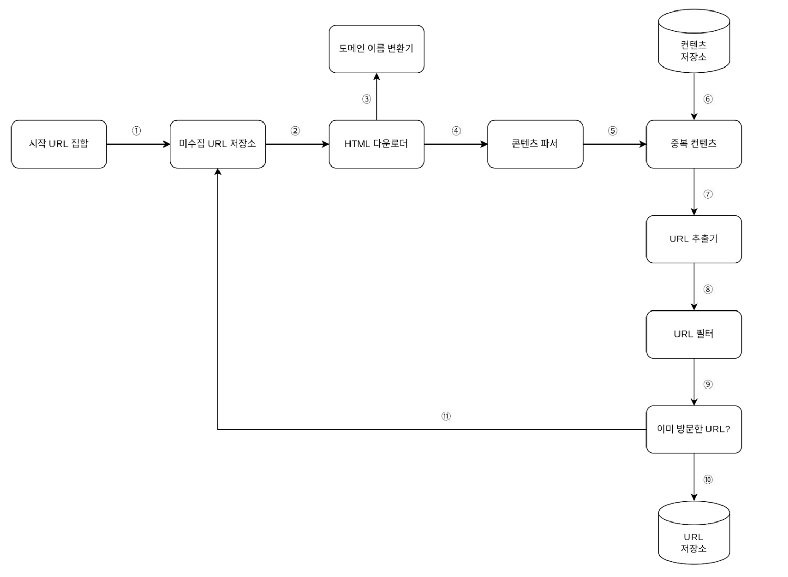

# [가상 면접 사례로 배우는 대규모 시스템 설계 기초](https://www.yes24.com/Product/Goods/102819435)
저자: 알렉스쉬

---

# 9장 웹 크롤러 설계

## 웹 크롤러 종류
- **검색 엔진 인덱싱**
- 웹 아카이빙
- 웹 마이닝
- 웹 모니터링

## 웹 크롤러의 기본 알고리즘
1. URL집합이 주어지면 해당 URL이 가르키는 모든 웹페이지를 다운로드 한다.
2. 다운받은 웹페이지에서 URL들을 추출한다.
3. 위의 작업을 반복한다.

## 요구사항

- 10억개의 웹 페이지 수집
- 수집한 웹 페이지는 5년간 수집
- 중복된 컨텐츠 무시

## 계락적 규모

- 매달 10억개의 웹 페이지를 다운로드한다.
- QPS = 10억/30일/24시간/3600초 = 대략 400페이지/초
- 최대(peak) QPS = 2 * QPS = 800
- 웹 페이지의 크기 평균은 500k라고 가정
- 10억 페이지 * 500k = 500TB/월
- 1개월치 데이터를 보관하는 데는 500TB, 5년간 보관한다고 가정하면 결국 500TB 12개월 5년 = 30PB의 저장용량이 필요

## 작업 흐름

## 상세 설계
1. redis 캐시에 미수집 url을 집어넣는 pub을 생성한다.
2. 전면 큐 선택기는 해당 Pub를 sub 하고 있다가 값이 들어오면 해당 값을 전면큐에 배치한다.
3. 후면 큐 선택기는 큐의 우선순위에 따라 최 우선순위는 3번 그 이후로는 1개씩 줄여가면서 값을 가져온다.
4. 후면 큐 선택기는 전면큐에 값이 들어오면 해당 값을 후면큐에 입력한다.
5. 후면 큐에 값이 들어오면 큐의 우선순위에 따라 최 우선순위는 3번 그 이후로는 1개씩 줄여가면서 값을 가져온다.
6. HTML 다운로드 부터 작업을 실행한다.

## 실행 방법
1. db_compose를 실행시켜 준다.
2. Pg pool이 정상적으로 연결되는지 확인한다.
3. go 프로그램을 실행시킨다.
4. url 컨테이너의 redis에 접근한다.
5. url 에 urls 를 pub 시켜준다.
---

# Result

## Cralwer Architecture
