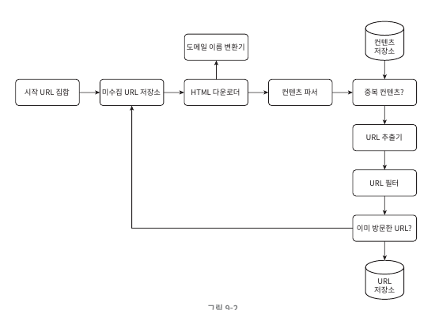
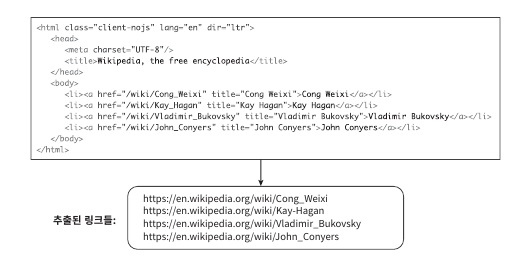
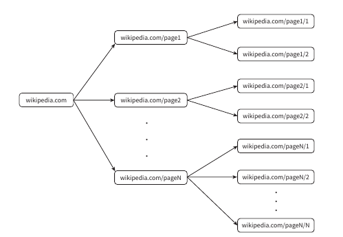
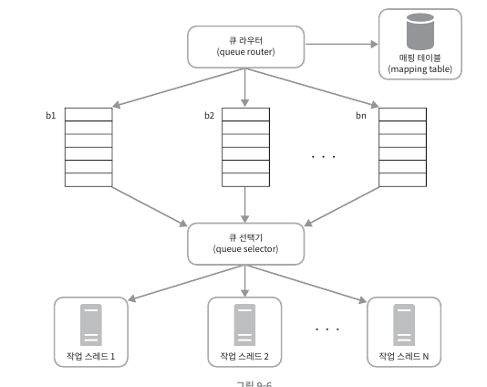
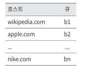
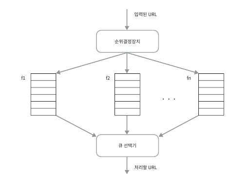
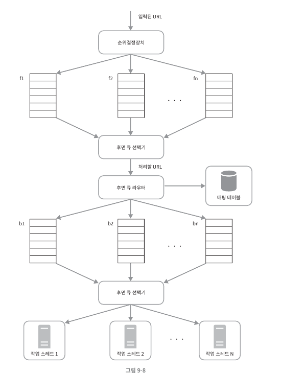
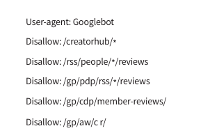
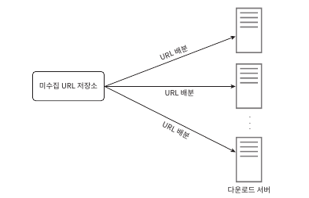
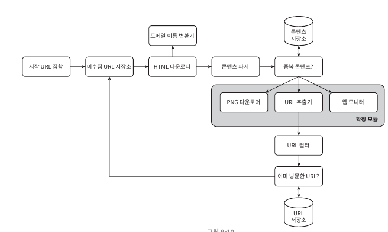

# 9-Web-Crawler-Design
# [가상 면접 사례로 배우는 대규모 시스템 설계 기초](https://www.yes24.com/Product/Goods/102819435)
저자: 알렉스쉬

---

# 9장 웹 크롤러 설계

## 만들어야할 크롤러는 검색엔진 인덱싱을위한 크롤러
- 검색엔진 인덱싱의 궁극적인 목적은 사용자가 입력한 검색어에 대해 가장 관련성 높은 웹 페이지를 빠르게 제공하는 것입니다. 인덱싱을 통해 각 웹 페이지의 내용과 키워드를 미리 분석해 놓으면, 실제 검색 시 빠른 속도로 관련 페이지를 찾을 수 있게 됩니다.
---- 
## 계략적 설계안

#### 1. 시작 URL 집합
- 크롤링을 시작하는 출발점으로 해당 URL을 기점으로 URL을 추출하여 크롤링을 한다.

#### 2. 미수집 URL 저장소
- 다운로드할 URL을 FIFO 방식으로 저장할 큐

#### 3. HTML 다운로더
- 웹페이즈를 다운로드하는 컴포넌트로 다운로드할 URL은 미수집 URL 저장소에서 제공

#### 4. 도메인 이름 변환기
- URL을 IP주소로 변환하는 절차필요 HTML 다운로더에서 도메인 이름 변환기를 사용하여 URL에 대응하는 IP주소를 찾는다.

#### 5. 콘텐츠 파서
- 다운받은 HTML에서 파싱과 검증절차를 거쳐야한다. 이상한웹페이지및 저장공간의 효율성을위함이다. 크롤링 서버안에 콘텐츠 파서를 구현하면 크롤링 과정이 느려지게 될 수 있으므로, 독립된 컴포넌트로 만들어야 한다.

#### 6. 중복 콘텐츠인가?
- 29% 가량은 중복 콘텐츠이다. 웹페이지의 해시값을 비교하여 중복된 콘텐츠를 걸러낸다.

#### 7. 콘텐츠 저장소
- HTML 문서를 보관하는 시스템이다. 저장할 데이터의 유형, 크기, 저장소 접근 빈도, 데이터의 유효기간등을 종합적으로 고려해야한다.
- 데이터 양이 너무 많으므로 대부분의 콘텐츠는 디스크에 저장한다.
- 인기 있는 콘텐츠는 메모리에 두어 접근 지연 시간을 줄일 것이다.

#### 8. URL 추출기
- URL 추출기는 HTML을 파싱하여 링크들을 골라내는 역할이다. 상대경로는 전부 https://en.wikipedia.org 를 붙여 절대 경로로 변환한다.

#### 9. URL 필터
- 특정 콘텐츠 타입이나 파일 확장자를 갖는 URL, 접속 오류발생하는 URL, 접근 제외 목록에 포함된 URL 등을 배제하는 역할

#### 10. 이미 방문한 URL?
- 이미 방분한 적이 있는 URL인지 추척하여 서버부하 줄이고 무한루프에 빠지는걸 방지한다.
블룸 필터나 해시 테이블이 널리 사용된다.

#### 11. URL 저장소
- 이미 방문한 URL을 보관하는 저장소다.
-----

## 작업 흐름

1. 시작 URL들을 미수집 URL 저장소에 저장
2. HTML 다운로더는 미수집 URL 저장소에서 URL 목록 가져옴
3. HTML 다운로더는 도메인 이름 변환기를 사용하여 URL의 IP주소를 알아내고, 해당 IP 주소로 접속하여 웹 페이지 다운
4. 콘텐츠 파서는 다운된 HTML 페이지를 파싱하여 올바른 형식을 갖춘 페이지 인지 검증
5. 중복 콘텐츠인지 확인
6. 중복콘텐츠인지 확인하기 위해서는 이미 저장소에 있는지 봐야한다. 이미 저장소에 있는 콘텐츠면 버린다. 저장소에 없는 콘텐츠인 경우에 저장소에 저장한뒤 URL추출기로 전달
7. URL 추출기는 해당 HTML에서 링크 추출
8. 골라낸 링크 URL필터 전달
9. 필터링이 끝나고 남은 URL만 중복 URL 판별 단계로 전달
10. 이미 처리한 URL인지 확인하기 위해 URL 저장소에 보관된 URL인지 살피고 이미 저장소에 있는 URL은 버린다
11. 저장소에 없는 URL은 URL 저장소에 저장할 뿐 아니라 미수집 URL 저장소에도 전달한다.

-----

## 상세 설계
- DFS vs BFS
- 미수집 URL 저장소
- HTML 다운로더
- 안정성 확보 전략
- 확장성 확보 전략
- 문제 있는 콘텐츠 감지 및 회피 전략

### DFS vs BFS
- 웹 유향 그래프(간선에 방향이있는 그래프)와 비슷하다. DFS는 그래프 크기가 클 경우 어느 정도로 깊숙이 가게 될지 가늠하기 어려워서 좋은선택이 아닐수가 있다.
그래서 BFS를 사용한다. 
- 한쪽으로는 탐색할 URL 집어넣고, 다른 한쪽으로는 꺼내기만 한다.
- '예의 없는 크롤러'를 주의 해야한다 wikipedia.com 에서 추출한 모든 내부 링크는 wikipedia.com 서버의 다른페이지를 참조하는 링크다 이때 위키피디아 서버는 수많은 요청으로 과부하에 걸리게 된다는것이다.
 
- 페이지 순위, 사용자 트래픽의 양, 업데이트 빈도등 여러 가지 철도에 비추어 우선순위를 구별하자.

### 미수집 URL 저장소
- 미수집 저장소를 활용하면 '예의 없는 크롤러'의 문제를 쉽게 해결 할수있다. URL 저장소는 다운로드할 URL을 보관하는 장소다. 이저장소를 잘 활용하면 '예의를 갖춘 크롤러'가 된다.
URL 사이의 우선순위와 신선도를 구별하는 크롤러를 구현할 수 있다. 

#### 예의 (미수집 URL 저장소 -> HTML다운로더(작업스레드)
- 웹 크롤러는 수집 대상 서버로 짧은 시간 안에 너무 많은 요청을 보내는것을 삼가해야한다. 무례한 일이며 떄로는 DoS 공격으로 간주되기도 한다.
- 예의 바른 크롤러를 만드는 데 있어 지켜야 할 한가지 원칙은, 동일 웹 사이트에 대해서는 한 번에 한 페이지만 요청한다는 것이다. 같은 웹사이트의 페이지를 다운받는 태스크는 시간차를 두고 실행하도록 하자.
이 요구를 만족시키기 위해 웹사이트의 호스트명과 다운로드를 수행하는 작업 스레드 사이의 관계를 유지하면된다. 즉 각다운로드 스레드는 별도 FIFO 큐를 가지고 있어서, 해당 큐에서 꺼낸 URL만 다운로드 한다.
  
- 큐 라우터 : 같은 호스트에 속한 URL은 언제나 같은큐(b1,b2.... bn)로 가도록 보장하는 역할
- 매핑 테이블 : 호스트 이름과 큐사이의 관계를 보관하는 테이블  
- FIFO 큐(b1부터 bn까지): 같은 호스트에 속한 URL은 언제나 같은 큐에 보관된다.
- 큐 선택기 : 큐 선택기는 큐들을 순회하면서 큐에서 URL꺼내어 작업 스레드에 전달하는 역할
- 작업 스레드 : 전달받은 URL을 다운로드하는 작업을 수행 전달된 URL은 순차적으로 처리 될것이며 작업들 사이에는 일정한 지연시간을 둘수 있음

##### 우선순위
- 'Apple' 이라는 키워드가 있을때 애플 제품에 대한 사용자 의견이 올라오는 포럼의 한페이지가 애플 홈페이지와 같은 중요도를 갖는다고 보기는 어렵다. 크롤러입장에서 중요한 페이지(애플 홈페이지)를 먼저 수집하도록 하는것이 바람직할 것이다.
- 유용성에 따라 우선순위를 나눌때는 페이지랭크, 트래픽양, 갱신비도 등 다양한 척도를 사용할수 있다.
- 순위 결정장치는 URL 우선순위를 정하는 컴포넌트이다. 

- 순위 결정장치 : URL 입력받아 우선순위를 계산
- 큐(f1...fn) : 우선순위별로 큐가 하나씩 할당된다. 우선순위가 높으면 선택 될 확률도 올라간다.
- 큐 선택기 : 임의 큐에서 처리할 URL을 꺼내는 역할담당 순위가 높은큐에서 더자주 꺼내도록 한다.

##### 위 내용들을 반영한 설계
 
- 전면 큐 : 우선순위 결정 과정을 처리한다
- 후면 큐 : 크롤러가 예의 바르게 동작하도록 보증한다.

#### 신선도
- 웹페이지는 수시로 추가, 삭제, 변경 된다 따라서 데이터 신선함을 유지하기위해 이미 다운로드한 페이지라도 주기적으로 재수집을 할필요가 있다. 그러나 모든 URL을 재수집 하는 것은 많은 시간및 자원이 필요하므로 최적하할 전략이필요하다
- 전략1 : 웹페이지의 변경 이력 활용
- 전략2 : 우선순위를 활용하여, 중요한 페이지 좀더 자주 재수집

#### 미수집 URL 저장소를 위한 지속성 저장장치
- 처리해야할 URL수가 많아지면 모두 메모리에 보관하는 것은 안정성이나 규모 확장성 측면에서 바람직하지 않다. 전부 디스크에 저장하는 것도 좋은 방법은 아닌데, 느려서 쉽게 성능 병목지점이 되기 떄문
- 절충안을 선택해야한다. 대부분 URL은 디스크에 두지만 IO 비용을 줄이기 위해 메모리 버퍼에 큐를 두는것이다. 버퍼에 있는 데이터는 주기적으로 디스크에 기록할 것이다.

### HTML 다운로더 
- HTML 다운로더는 HTTP 프로토콜을 통해 웹 페이지를 내려받는다. 먼저 로봇제외 프로토콜을 살펴봐야한다.

#### Robots.txt
- Robots.txt 은 웹사이트가 크롤러와 소통하는 표준적 방법이다. 해당파일에는 크롤러가 수집해도 되는 페이지 목록이 있다. 스크랩 하기전에 해당 파일에 나열된 규칙을 확인해야한다.
- Robots.txt 파일을 거푸 다운로드하는것을 피하기위해 주기적으로 다시 다운받아 캐시에 보관할것이다 Robots.txt에는 아래와 같은 내용들이있다
 

### 성능 최적화
- 아래는 HTML 다운로더에 사용 할 수 있는 성능 최적화 기법들이다.
1. 분산 크롤링
   - 성능을 높이기 위해 여러서버에 분산하고 각서버는 여러 스레드를 돌려 작업처리 한다. 
   - 
2. 도메인 이름 변환 결과 캐시
   - DNS는 크롤러 성능에 병목현상중 하나이다 이유는 DNS요청 처리 작업 프로세스가 동기적이라는 특성 떄문이다. 크롤러 스레드 가운데 어느하나라도 이작업을 하고있으면 다른 스레드의 DNS요청은 전부 블록된다.
   - 따라서 DNS 조회 결과로 얻어진 도메인 이름과 IP주소 사이의 관계를 캐시에 보관해 놓고 크론 잡등을 돌려 주기적으로 갱싱한도록 해놓으면 성능에서 효과를 본다.
3. 지역성
   - 크롤링 작업 수행서버를 지역별로 분산하는 방법이다 크롤링서버가 크롤링 대상서버와 지역적으로 가까우면 다운로드 시간은줄어들 것이다. 지역성을 활용하는 전략은 크롤서버, 캐시, 큐, 저장소 등 대부분의 컴포넌트에 적용 가능하다.
4. 짧은 타임아웃
   - 어떱 웹서버는 응답이 느리거나 응답하지 않는 경우가있다 이런경우 대기시간이 길어지면 좋지 않으므로 최대 얼마나 기달릴지 미리 정해둬서 응답안하면 다운로드 중단하고 다음페이지로 넘어간다.

### 안정성
- 최적화 뿐만 아니라 안정성도 중요하게 고려해야할 부분이다.
- 안정 해시 : 다운로더 서버들에 부하를 분산할 떄 적용 가능한기술이다. 다운로더 서버를 쉽게 추가하고 삭제할수 있다
- 크롤링 상태 및 수집 데이터 저장 : 장애가 발생한 경우에도 쉽게 복수할 수 있도록 크롤링 상태와 수집된 데이터를 지속적 저장장치에 기록해 두는 것이 바람직하다. 저장된 데이터를 로딩하고 나면 중단되었던 크롤링을 쉽게 재시작할 수 있을것이다.
- 예외처리 : 대규모 시스템에서 에러는 불가피할 뿐아니라 흔이벌어지는 일이다. 예외가 발생해도 전체 시스템이 중단되는 일 없이 그작업을 우아하게 이어나갈수 있어야한다.
- 데이터 검증 : 시스템 오류를 방지하기 위한 중요 수단 가운데 하낟.

### 확장성
- 진화하지 않는 시스템은 없는 법이라서, 이런시스템 설계할떄는 새로운 형태의 콘텐츠를 쉽게 지원할수 있도록 신경써야한다. 9장 크롤러 설계인경우에는 새로운 모듈을 끼워 넣음으로써 새로운 형태의 콘텐츠를 지원할수 있도록 설계 했다.
 
- PNG 다운로더는 PNG 파일을 다운로드하는 플러그인 모듈
- 웹 모니터는 웹을 모니터링하여 저작권이나 상표권이 침패되는 일을 막는 모듈

### 문제 있는 콘텐츠 감지 및 회피
1. 중복 콘텐츠
   - 웹콘텐츠의 30%는 중복이다. 해시나 체크섬을 사용하면 중복콘텐츠를 보다 쉽게 탐지가능하다
2. 거미덫
   - 거미덫은 크롤러를 무한 루프에 빠뜨리도록 설계한 웹페이지다. 예를들어 spiderapexample.com/foo/bar/foo/bar/foo/bar/... 이런덫은 URL최대 길이 제한하면 피할수있지만 이런 덫이 설치된 웹사이트를 알아내는건 쉽지가않다. 한가지 방법으로는 사람이 수작업으로 덫을 확인하고 찾아낸 후 덫이 있는 사이트를 담색대상에사 제외하거나 URL필터 목록에 걸어두는것이다.
3. 데이터 노이즈
   - 어떤 콘텐츠는 거의 가치가 없다. 광고나 스크립트 코드, 스팸 URL같은 것이 그런데 이런 콘텐츠는 크롤러에게 도움될 것이 이없으므로 가능하다면 제외해야 한다.

----------

## 1 차작업
1. 미수집 저장소를 Redis로 사용
2. HTML 다운로더를 파이썬 멀티스레드 or 멀트프로세스로 진행

